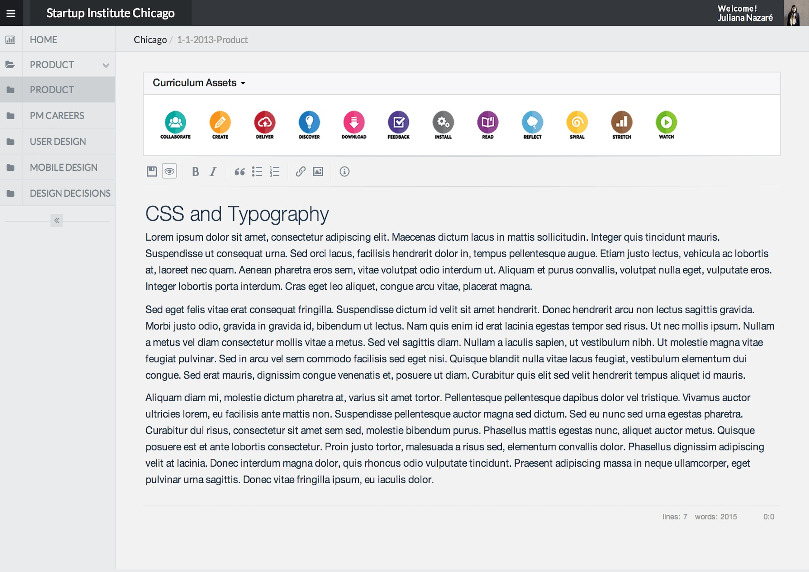

I worked on a ~1 year-long project nicknamed "Github for Curriculum," a web application that uses the power of Github’s version control in a simple-to-use web application for people that do not use Github. This is a project that I worked on for Startup Institute, a educational company that runs schools in New York, Chicago, and Boston.

The idea for the project stemmed from a problem that the company faced when revising Startup Institute's curriculum, which is routinely taught by 100 instructors across 3 cities. We decided that the first step to having a manageable curriculum was to be able to track the revisions being made to the curriculum by each of the instructors.

After looking into spinning up our own Gitorious server, I decided to use Github itself as our version-controlled backend and built a web application that allowed non-technical instructors to interface with our curriculum on Github. The second iteration of the interface is shown below.

 
I built the web application in Node.Js, using the markdown parser Marked, ACE editor, and the Github v3 API. I finished the first and second versions of the application, worked through user-testing with students and instructors that will use the application, and deployed the applications to Startup Institute students and instructors across the United States.