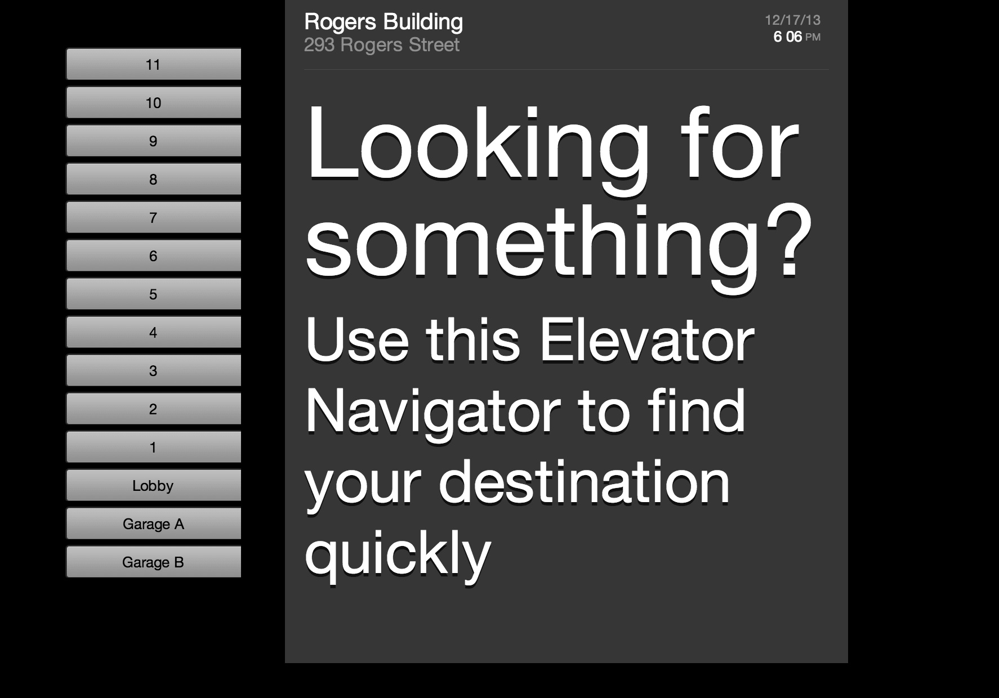

For Olin's Human Factors Interface Design course, I was on a team of four working on a semester-long project to redefine the elevator experience, concentrating on elevator bays in tall office buildings. We began by interviewing users, then moved to paper-prototyping, low-fidelity and high-fidelity prototyping on the web. Finally, we came up with our final product, an elevator kiosk that helps visitors navigate to their destination. We were all involved in every part of this design process, from the initial idea, to the user testing, to the final design presentation.

- For more details, check out our [project page](http://hfid.olin.edu/sa2013/s_engr3220-unibros/final.php), which has every step of our process.
- For a working demo of the interface, check out this [link](http://tcr.github.io/elevator-kiosk/).

Teammates: Tim Ryan, Cory Dolphin, Inigio Betia