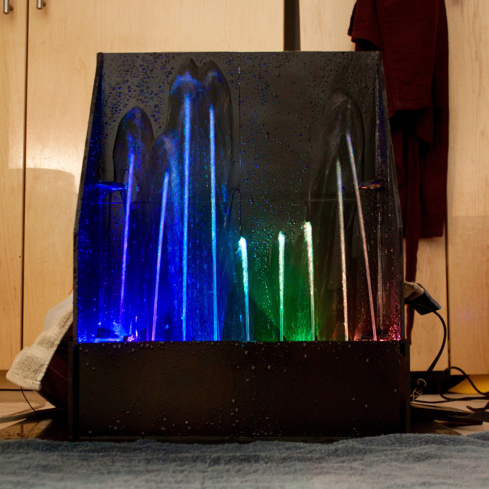
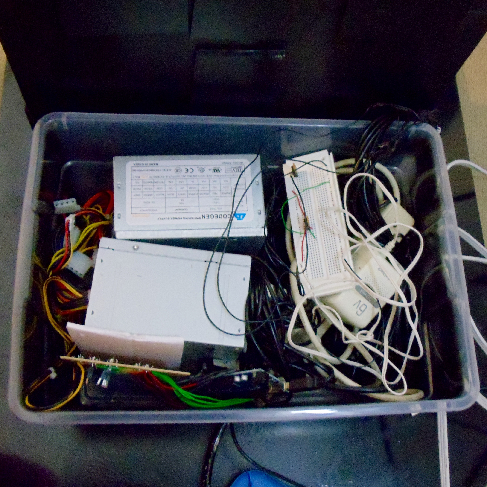
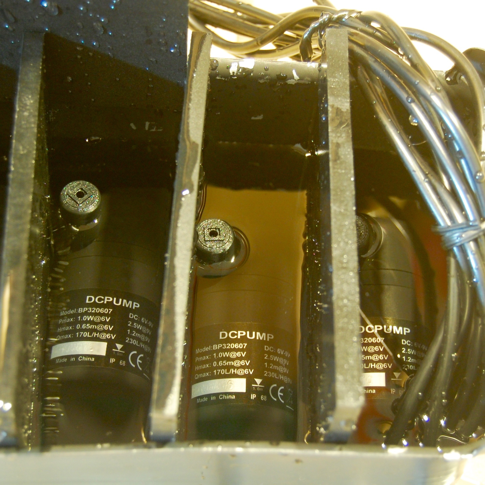
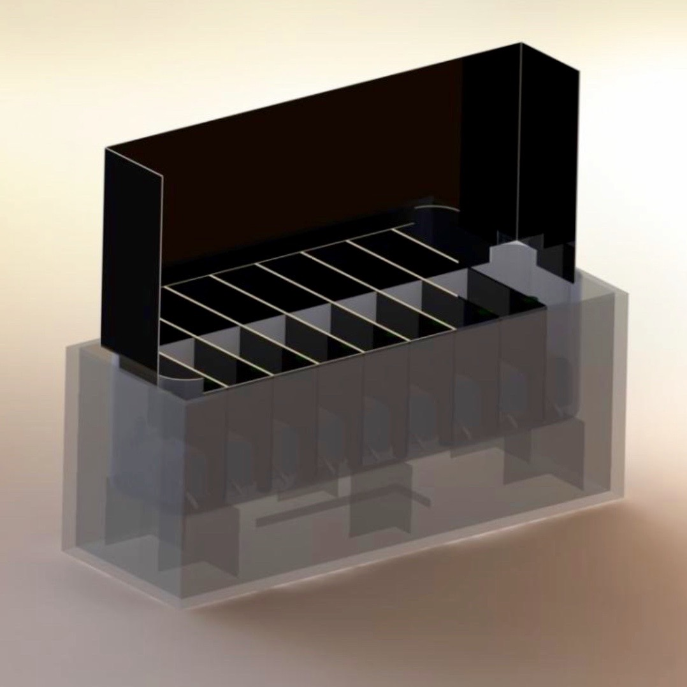

For Olin's Principles of Engineering project, I worked on a small team to create a fountain that dances to music. I had two roles on the team. I was in charge of writing the Arduino code that interfaced with the Python GUI and the electrical system and I wrote the Python code that parsed through a media file, using an FFT to find the relative powers of each frequency range present, and then convert these powers to PWM signals to send over a serial to the Arduino.

The final project is demostrated in the video below.

<iframe src="https://player.vimeo.com/video/150721532" height="281" frameborder="0" webkitallowfullscreen mozallowfullscreen allowfullscreen style="max-width: 500px;"></iframe>

 

  

  	
  	 
  	The working fountain
  

  

  	
  	 
  	Waterproofing the electrical setup
  

  

  	
  	 
  	Testing the waterproofing setup
  

  

  	
  	 
  	Render of the fountain
  

Teammates: Arjun Aletty, Eerik Helmick, Chris Mark