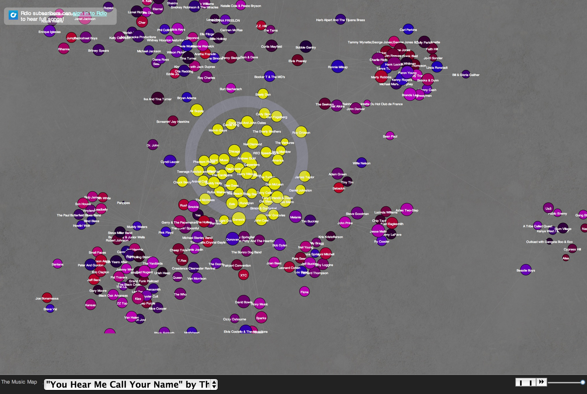

We spent 24 hours creating a way for users to spatially create radio stations, a method of music discovery not currently employed by popular music streamers such as Rdio and Spotify. A user can create a playlist by drawing circles around their favorite songs. If they want to stick to very similar songs, they can make the circle small. If they want a broad selection of songs similar to their selected song, they can increase the radius of the circle. A screenshot of the application is shown below.

 
This project won 2nd Place, crowd favorite, and best UI at HackMIT in February 2013.

Teammates: Rachel Bobbins, Geoff Pleiss, and Tim Ryan