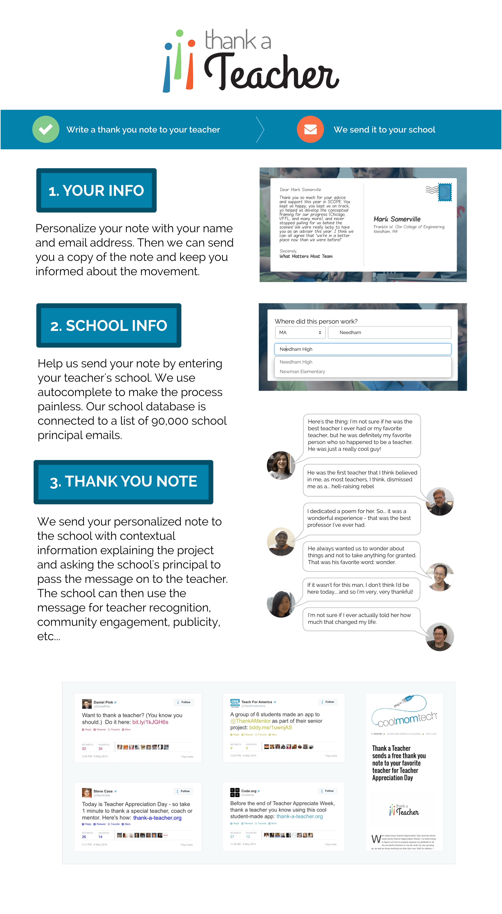

As part of a 6-person team, I worked on creating Thank-A-Teacher.org, a webapp that allowed people all over the US to look up their school and send a thank you note to their past or present teachers. The inspiration for this idea came as part of our senior capstone project at Olin College, where we were working with Ted Dintersmith and Tony Wagner on prototyping ways to catalyze school reform from their documentary [Most Likely To Succeed](http://mltsfilm.org). We dedicated the last 3 months of our capstone project to pursuing this idea.

Send a thank you note to a teacher on the live [thank-a-teacher.org](http://www.thank-a-teacher.org/) site.

