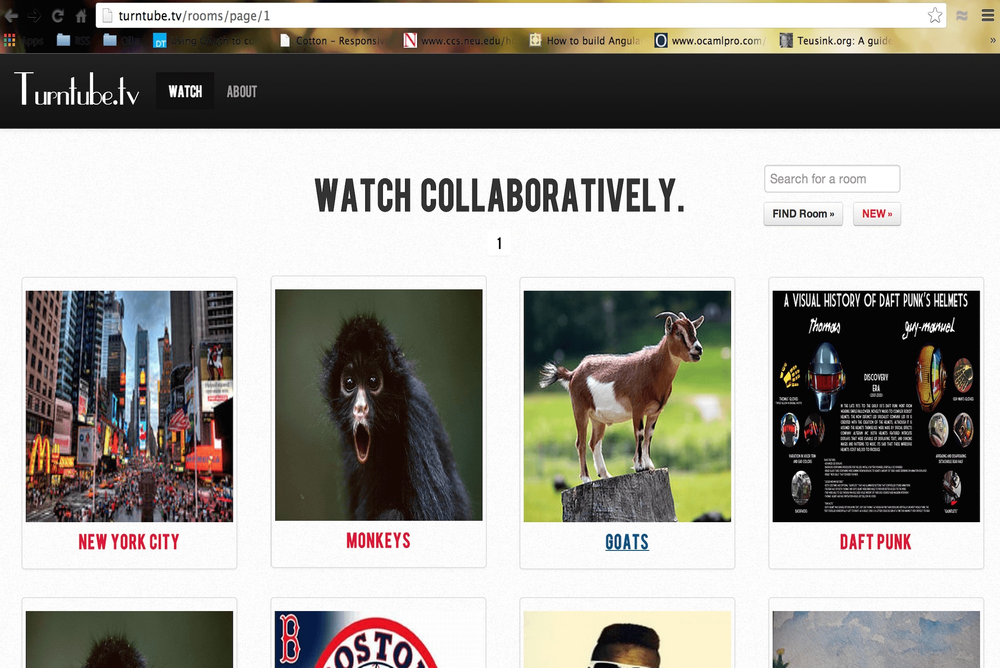

About 72 hours of video are uploaded to Youtube every minute. Youtube gets more than 1 billion unique visits each month*. Youtube due to its vast scale is responsible for channeling creative communities to their desired audiences. However, with such a vast scale, opinions, thoughts, and desires then to get lost in the midst of the mass data stream.

Turntube solves this problem by creating small theme based video rooms where a small number of viewers share videos and interact with each other while enjoying awesome videos. This helps both the content creators as well as Youtube to understand what the viewers real opinions are. It also a place for crowd sourcing categorization as users pick videos for each theme.

I worked mostly on the front end for this project, striving to design an interface that could fit multiple videos, a chat window, and user information in an easy-to-understand manner. I was in charge of designing this interface, implementing it, and hooking it up to the backend that my teammates constructed. A screenshot of the application can be seen below.

 
Teammates: Reyner Crosby and Aman Kapur

*Stats as of May 2013 when the project was created